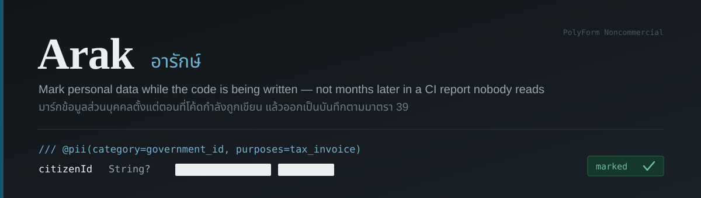

<p align="right"><strong>English</strong> · <a href="README.th.md">ภาษาไทย</a></p>

Arak marks personal data **while the code is being written** — not months later in a CI report
nobody reads. It keeps a reviewable catalog of every field that holds personal data, with its
purpose, legal basis and retention, and turns that into a Thai PDPA Record of Processing
Activities (RoPA).

It ships as a Claude Code plugin, a CLI, and a Thai PII detection library.

**Free for personal, educational, research and nonprofit use. Commercial use requires a licence** —
see [COMMERCIAL.md](COMMERCIAL.md).

---

## The problem

Privacy tooling today **scans after the fact**. The report arrives once the code is already on CI,
by which time the field is used all over the system and nobody goes back to fix it.

The right moment is **the instant the field is written**, while whoever wrote it — human or AI
assistant — still remembers what it is for.

And no existing tool knows Thai law. Section 39 of the Personal Data Protection Act requires a
record covering seven items: what is collected, why, who controls it, how long it is kept, the
rights and access conditions, disclosures under section 27, and grounds for refusing a request —
plus a description of the security measures required by section 37.

## How it works


## Install

Open Claude Code in the project you want to protect, then:

```
/plugin marketplace add ksmaster03/arak
/plugin install arak@arak
```

Restart Claude Code, then run `/arak:setup`.

That is the whole install. The plugin bundles its hooks **and** the full `arak` CLI into
dependency-free files, so there is no `npm install`, no `settings.json` to hand-edit, and nothing
to add to your `PATH`.

| Command | What it does |
|---|---|
| `/arak:setup` | Sets the project up from scratch, then helps you fill in the section 39 fields |
| `/arak:mark` | Walks through undecided fields one at a time |
| `/arak:check` | Reports status, and finds real personal data sitting in your files |

<details>
<summary>Using the CLI on its own</summary>

```bash
git clone https://github.com/ksmaster03/arak.git && cd arak
pnpm install && pnpm run build

node packages/cli/dist/index.js init      # create arak.config.yaml + pii-catalog.yaml
node packages/cli/dist/index.js sync      # read the schema, reconcile the catalog
node packages/cli/dist/index.js baseline  # park existing fields as acknowledged debt
node packages/cli/dist/index.js status    # the CI gate
node packages/cli/dist/index.js scan      # find real personal data in files
```

`packages/plugin/bin/arak.mjs` is the same CLI bundled with zero dependencies — it runs from a
bare checkout with no `node_modules` at all.
</details>

## The first run


Installing into a codebase written two years ago will surface dozens of pending fields at once.
`arak baseline` moves them all to **acknowledged debt** — still counted and reported every run,
but no longer failing CI and no longer nagging you in the editor. From then on you are only asked
about what you write next.

A privacy tool that goes red on day one is a privacy tool that gets switched off on day two.

## Marking

Write it in the Prisma doc comment above the field. Any prose already there stays where it is.

```prisma
model Customer {
  /// Tax ID, used to issue invoices
  /// @pii(category=government_id, purposes=tax_invoice)
  taxId String?

  /// @pii(category=contact, purposes=delivery;tax_invoice)
  email String?

  /// @pii(contact)
  phone String?

  /// @not-pii(reason="Internal reference, randomly generated, not tied to a person")
  refCode String
}
```

| Key | Meaning |
|---|---|
| `category` | Data category — a bare value is shorthand: `@pii(contact)` |
| `purposes` | Keys declared in the catalog's `purposes`; separate several with `;` `\|` or `+` |
| `retention` | ISO-8601 duration such as `P5Y`, when this field differs from its purpose |
| `reason` | For `@not-pii` only |

Categories come in two sets. The general ones — `identity` `government_id` `contact` `financial`
`employment` `education` `location` `device` `behavioral` `media` `family` `vehicle` `credential` —
and the **sensitive ones under section 26** — `health` `disability` `belief_religion`
`race_ethnicity` `political_opinion` `sexual_behavior` `criminal_record` `union` `genetic`
`biometric` — which are counted separately because they need explicit consent.

## The catalog

`pii-catalog.yaml` is the single source of truth, and it lives in git.

```yaml
purposes:
  - key: tax_invoice
    label: Issue tax invoices and retain accounting records
    legalBasis: legal_obligation   # s.24(6)
    retention: P5Y                 # s.39(4)

fields:
  - id: prisma:Customer.taxId
    status: marked
    category: government_id
    purposes:
      - tax_invoice
    source:
      kind: prisma
      file: prisma/schema.prisma
      line: 29
      container: Customer
      field: taxId
```

Two halves, two owners, and the tool respects the line strictly:

- `controller` `purposes` `access` `securityMeasures` are **yours**. The tool never edits them, and
  comments you write there survive every sync.
- `fields` is kept in step with the source, but **nothing is ever deleted**. A field that disappears
  from the code is flagged `orphaned`, because dropping a column does not delete the data behind it.

## Decision rules

Three rules, and only three:

1. A field with `@pii(...)` in the code — **the code wins**, because it travels with the code.
2. No annotation but already in the catalog — **the catalog wins**, because a human put it there.
3. Neither — the guesser proposes it as `unmarked` for a human to decide.

Statuses are `unmarked` (new, undecided — hook asks, CI fails), `deferred` (acknowledged debt — no
nagging, CI passes, still counted), `marked`, and `not-pii`. Once a human decides, the guesser's
`confidence` and `detectedBy` are dropped rather than left to confuse the next reader.

**Step 3 is never automated past the category.** Data categories can be read off the code, but
purposes and legal bases are business decisions. An `email` kept to send receipts (basis: contract)
and one kept to send promotions (basis: consent) look identical in code and are governed by
different law. When nothing in the catalog fits, the plugin stops and asks. A RoPA that looks
tidy but is wrong is more dangerous than no RoPA at all.

## Finding real data in files

`sync` covers what the *schema* declares. `scan` looks at whether the *files* contain real people's
data — seed scripts, fixtures, sample SQL, a log that got committed by accident.

```
$ arak scan

ที่พบ
  thai_national_id     11••••••••66     prisma/seed.ts:3:40
  thai_phone           08••••••••78     prisma/seed.ts:3:64
  email                so••••••••th     prisma/seed.ts:3:87
```

**Real values are never printed.** You see the first and last characters only, because CI logs
outlive the files they scanned.

Detectors live in `@arak/detect-th`, which is usable on its own:

| Type | How it is detected |
|---|---|
| Thai national ID · tax ID | 13 digits **with the check digit verified**, which throws out ~91% of random reference codes |
| Phone | Real structure — mobile 06/08/09 plus eight digits, `+66` supported |
| Email · IPv4 | Standard formats |
| Thai personal name | Anchored on the honorifics นาย นาง นางสาว น.ส. ด.ช. ด.ญ. |
| Thai address | ต. อ. จ. แขวง เขต ซอย หมู่ ถนน — adjacent parts merge into one address |
| Licence plate | Two Thai consonants, with or without a leading digit |
| Credit card | 14–19 digits with Luhn |
| Passport · bank account · postal code | **Context word required nearby**, otherwise false positives drown everything |

> The Thai ID check digit has a measured blind spot: the third digit carries weight 11, which is
> divisible by 11 and therefore contributes nothing to the remainder. **Change the third digit to
> anything and the formula cannot tell.** Other positions slip through about 1.7% of the time.
> Good enough to screen with, never good enough to verify identity with.

Files that deliberately contain realistic-looking data can be skipped:

```yaml
scan:
  ignore:
    - "**/test/**"
```

or `--ignore "<glob>"` on the command line, repeatable.

## CI gate

```yaml
- run: node packages/cli/dist/index.js status
```

- `0` — every new field has been decided
- `1` — undecided fields remain, or the catalog has an error such as a field marked as personal
  data with no purpose (section 39(2) requires one)
- `2` — called wrongly, or a file could not be read

Add `--strict` to make acknowledged debt fail too, once the team is ready to clear it.
Use `sync --check` to require that the committed catalog always matches the schema.

## Status

TypeScript + Prisma is the first supported stack.

| Done | Not yet |
|---|---|
| Catalog schema covering section 39 | RoPA document generator (.docx/.xlsx) |
| Prisma schema reader with `@pii` | Semgrep rules that stop PII reaching logs |
| Catalog writes that preserve your comments | MCP server for redacted file reads |
| 39 field-name heuristics | OpenAPI and TypeScript type readers |
| 12 Thai value detectors | Thai names without an honorific |
| Deterministic, reversible redactor | Publishing to npm and a public marketplace |
| Three Claude Code hooks plus baselining | |
| `init` / `sync` / `baseline` / `status` / `scan` | |

The field-name guesser reads names and types only. It exists so there is something to decide on
day one, and every rule in it was tuned against four production schemas — a warehouse system, a
maintenance system, an HR system, and the clinic schema in
`arak-sandbox`.

## Development

```bash
pnpm test        # 155 tests
pnpm run build
pnpm run typecheck
```

```
packages/core       Catalog model · decision rules · YAML I/O · field-name heuristics
packages/prisma     Prisma schema reader and the @pii annotations
packages/detect-th  Thai value detectors and the reversible redactor (no dependencies)
packages/cli        The arak command
packages/plugin     Claude Code plugin — hooks, commands, and a bundled arak
examples/demo-app   A worked schema used as a test bed
.claude-plugin/     Marketplace catalog
```

The whole project has exactly one runtime dependency, [`yaml`](https://github.com/eemeli/yaml).
For a tool that reads other people's schemas and data, the dependency count is part of the
trust story.

The plugin is bundled with esbuild into one file per entry point **on purpose**: Claude Code
installs a plugin by copying only the plugin directory into its cache, and link mode is
unavailable on Windows, so anything importing across the workspace would break on arrival.

Every detector rule was tuned against real data, not invented at a desk. When you change a rule
because of a case you hit, **add that case to the tests with a comment saying where it came from.**

## License

[PolyForm Noncommercial License 1.0.0](LICENSE) — source available, not open source.

Free for personal use, hobby projects, research, education, charities and government.
**Any use by or for a for-profit company needs a commercial licence, including purely internal
use.** See [COMMERCIAL.md](COMMERCIAL.md) for what that covers and how to get one.

Whatever Arak produces — your catalog, your RoPA — is entirely yours, with no strings attached.
