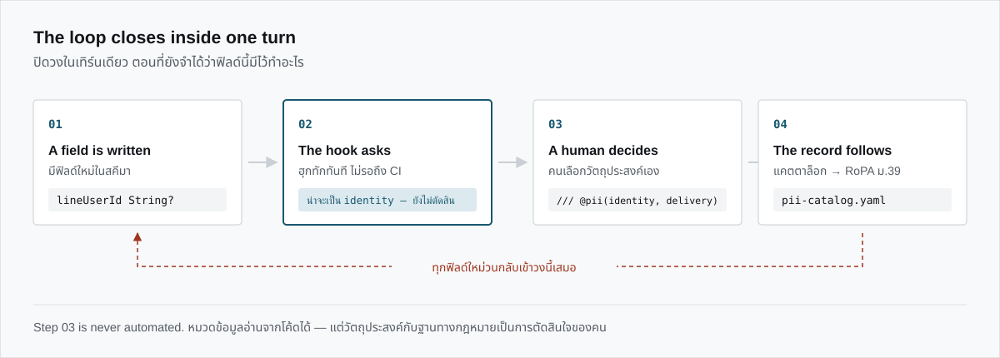
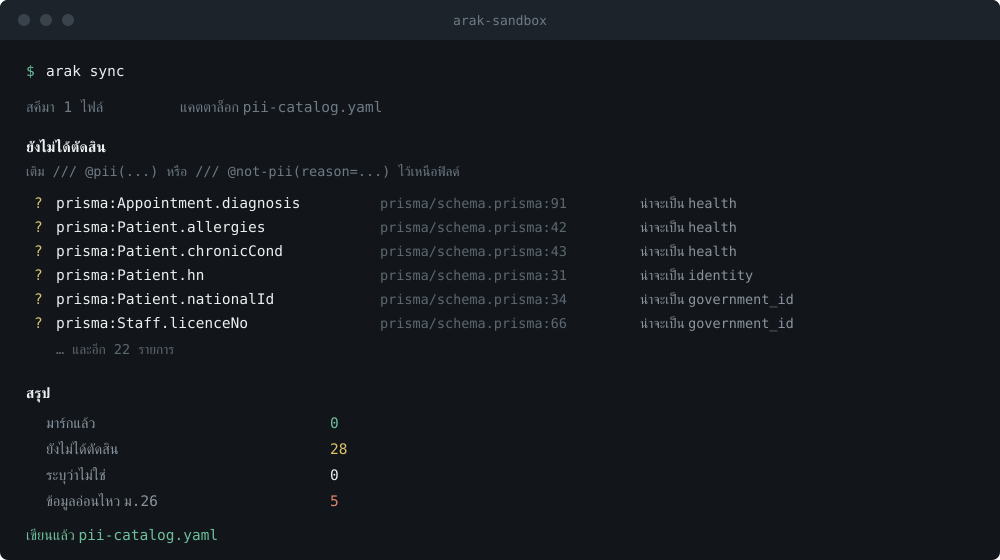

<p align="right"><a href="README.md">English</a> · <strong>ภาษาไทย</strong></p>

## ที่มาของชื่อ

**อารักษ์** คือเทวดาผู้ดูแลรักษาสถานที่ บ้านหนึ่งหลัง ที่นาหนึ่งผืน โค้งน้ำหนึ่งโค้ง
คนไทยตั้งศาลไว้ที่มุมรั้วแล้วถวายของทุกเช้า ด้วยความเข้าใจอย่างหนึ่งว่า
ของที่ควรได้รับการปกป้องที่สุด มักเป็นของที่ไม่มีใครนึกถึงว่าต้องปกป้อง

ฐานข้อมูลของคุณก็เป็นสถานที่แบบนั้น ในนั้นมีเลขบัตรประชาชนอยู่สักคอลัมน์
มีเบอร์โทรอยู่อีกคอลัมน์ อาจมีผลวินิจฉัยโรคอยู่ด้วย ทั้งหมดเป็นเรื่องของคนจริง
ที่ยื่นข้อมูลให้เราแล้วเชื่อว่าจะมีใครสักคนดูแลมันไว้

ไม่มีใครนึกถึงเรื่องนั้น ทุกคนนึกถึงกำหนดส่งงาน

## มันทำอะไร

อารักษ์เฝ้าดูจังหวะที่ฟิลด์ใหม่ถูกเขียนลงสคีมา แล้วถามทันทีตรงนั้นว่า
ฟิลด์นี้ถือข้อมูลของคนหรือเปล่า และเก็บไว้ทำอะไร

คำตอบถูกเก็บเป็นแคตตาล็อกที่อยู่ในรีโปเดียวกับโค้ดที่มันอธิบาย
และจากแคตตาล็อกนั้นก็ออกมาเป็นเอกสารที่กฎหมายต้องการจริง ๆ
คือบันทึกรายการกิจกรรมการประมวลผลตามมาตรา 39 ของ พ.ร.บ.คุ้มครองข้อมูลส่วนบุคคล

มาในรูปปลั๊กอินของ Claude Code, คำสั่งบรรทัดคำสั่ง
และไลบรารีตรวจข้อมูลส่วนบุคคลไทยที่หยิบไปใช้เดี่ยว ๆ ได้

---

## ทำไมต้องเป็นตอนเขียน

เครื่องมือความเป็นส่วนตัวที่มีขายอยู่ทุกวันนี้ล้วนสแกนย้อนหลัง
รายงานมาโผล่บนแดชบอร์ดหลังโค้ดขึ้นไปแล้วเป็นสัปดาห์
ตอนนั้นฟิลด์นั้นถูกอ่านไปแล้วเก้าเซอร์วิส ถูกคัดลอกลงแคชอีกสองที่
และถูกเขียนลง log ที่ไหนสักแห่งที่ไม่มีใครจำได้

รายงานนั้นถูกต้อง แต่ไม่มีใครทำตาม เพราะการแก้ตอนนี้กินเวลาทั้งสปรินต์
และมีเรื่องด่วนกว่าเสมอ เมื่อเทียบกับการเอาทั้งสปรินต์ไปแก้ฟิลด์ที่ทำงานได้อยู่แล้ว

มีอยู่จังหวะเดียวที่การทำให้ถูกแทบไม่มีต้นทุน คือจังหวะที่ฟิลด์เพิ่งถูกเขียน
ตอนที่คนเขียนยังจำได้อยู่ว่าฟิลด์นี้มีไว้ทำไม

จังหวะนั้นยาวประมาณสามสิบวินาที อารักษ์อยู่ในนั้น



---


## สามเส้นที่มันจะไม่ข้าม

ผู้พิทักษ์ที่ตัดสินใจแทนเจ้าของบ้านทุกเรื่อง ไม่ได้เป็นผู้พิทักษ์อีกต่อไป
แต่กลายเป็นภาระ อารักษ์จึงถือเส้นไว้สามเส้น

**จะไม่คิดวัตถุประสงค์ให้เอง** อารักษ์อ่านหมวดของข้อมูลจากโค้ดได้
ว่าอันนี้คือเบอร์โทร อันนั้นคือเลขบัตรประชาชน แต่สิ่งที่มันอ่านไม่ได้คือ *เก็บไว้ทำไม*
เพราะเหตุผลนั้นไม่ได้เขียนอยู่ในโค้ด และจะไม่มีวันเขียนอยู่ในโค้ด
ฟิลด์ `email` ที่เก็บไว้ส่งใบเสร็จ ยืนอยู่บนฐานสัญญา
คอลัมน์เดียวกันที่เก็บไว้ส่งโปรโมชัน ยืนอยู่บนฐานความยินยอม
ในสคีมาเหมือนกันทุกตัวอักษร แต่ในกฎหมายคนละเรื่อง
เมื่อไม่มีวัตถุประสงค์ไหนในแคตตาล็อกที่ตรง อารักษ์จะหยุดแล้วถามคุณ
บันทึกที่ดูเรียบร้อยแต่ผิด สร้างความเสียหายมากกว่าไม่มีบันทึกเลย

**จะไม่ลบอะไรทิ้ง** ฟิลด์หายไปจากสคีมาเป็นเรื่องปกติ
แต่ข้อมูลที่อยู่ข้างหลังฟิลด์นั้นไม่ได้หายตามไปด้วย
พอคอลัมน์หายไป อารักษ์จะทำเครื่องหมาย `orphaned` ไว้แล้วปล่อยรายการนั้นค้างอยู่อย่างนั้น
จนกว่าจะมีคนบอกว่าแถวข้อมูลจริง ๆ ไปอยู่ไหน

**จะไม่พูดสิ่งที่มันเห็นออกมา** เวลาอารักษ์กวาดหาข้อมูลจริงในไฟล์ มันพิมพ์ `08••••••••78`
ไม่เคยพิมพ์เลขเต็ม เพราะ log ของ CI อยู่นานกว่าไฟล์ที่มันสแกน
และเครื่องมือที่ไล่หาความลับแล้วตะโกนสิ่งที่เจอลง log
ก็กลายเป็นช่องรั่วเสียเองแทนที่จะเป็นคนอุด

<br clear="right">

---

## ติดตั้ง

เปิด Claude Code ที่โปรเจกต์ที่อยากให้เฝ้า

```
/plugin marketplace add ksmaster03/arak
/plugin install arak@arak
```

รีสตาร์ต แล้วสั่ง `/arak:setup`

ใช้ผ่าน [claude.ai → Settings → Plugins → Add marketplace](https://claude.ai/settings/customize-plugins)
ก็ได้ ใส่ `https://github.com/ksmaster03/arak`

เท่านี้จบ ปลั๊กอินพกทั้งฮุกและคำสั่ง `arak` ตัวเต็มไว้ในไฟล์ที่ไม่มี dependency เลย
จึงไม่ต้อง `npm install` ไม่ต้องแก้ `settings.json` เอง และไม่ต้องเพิ่มอะไรลง `PATH`

| คำสั่ง | ทำอะไร |
|---|---|
| `/arak:setup` | ตั้งค่าให้โปรเจกต์ แล้วพาไล่เก็บรายละเอียดตามมาตรา 39 ที่ไม่มีเครื่องมือไหนเดาแทนได้ |
| `/arak:mark` | ไล่ปิดงานฟิลด์ที่ยังไม่ตัดสินทีละตัว พร้อมบอกเหตุผลที่เสนอ |
| `/arak:check` | ดูสถานะ แล้วกวาดหาข้อมูลจริงที่ค้างอยู่ในไฟล์ |

<details>
<summary>ใช้จากบรรทัดคำสั่งอย่างเดียว</summary>

```bash
git clone https://github.com/ksmaster03/arak.git && cd arak
pnpm install && pnpm run build

node packages/cli/dist/index.js init      # สร้าง arak.config.yaml + pii-catalog.yaml
node packages/cli/dist/index.js sync      # อ่านสคีมา แล้วปรับแคตตาล็อกให้ตรง
node packages/cli/dist/index.js baseline  # ยกของที่มีอยู่แล้วเป็นหนี้ที่รับรู้
node packages/cli/dist/index.js status    # ด่านสำหรับ CI
node packages/cli/dist/index.js scan      # หาข้อมูลจริงที่ปนอยู่ในไฟล์
node packages/cli/dist/index.js ropa      # บันทึกตามมาตรา 39 เป็น .xlsx
node packages/cli/dist/index.js semgrep   # กฎ Semgrep ที่งอกจากแคตตาล็อก
node packages/cli/dist/index.js export --format fideslang
```

`packages/plugin/bin/arak.mjs` คือโปรแกรมตัวเดียวกันที่ bundle แล้ว รันจากโฟลเดอร์เปล่าได้
โดยไม่ต้องมี `node_modules` เลยสักตัว

เครื่องที่ไม่มี SSH key การเขียนย่อ `owner/repo` อาจลอง SSH ก่อน
ให้ใส่ `https://github.com/ksmaster03/arak.git` เต็ม ๆ หรือตั้ง `CLAUDE_CODE_PLUGIN_PREFER_HTTPS=1`
</details>

---

## เอาไปจ่อกับโค้ดเก่า



รันอารักษ์กับสคีมาที่สะสมมาสองปี มันจะงัดฟิลด์ค้างขึ้นมาทีเดียวหลายสิบตัว
ตรงนี้คือจุดที่เครื่องมือความเป็นส่วนตัวส่วนใหญ่เสียผู้ใช้ไปตลอดกาล

`arak baseline` จึงเก็บทุกอย่างที่มีอยู่แล้วไปไว้ในกอง **หนี้ที่รับรู้แล้ว**
ยังนับอยู่ ยังพิมพ์ให้เห็นทุกครั้งที่รัน แต่ไม่ทำให้บิลด์ตกและไม่ขัดจังหวะการทำงานอีก
ตั้งแต่เช้านั้นไป คุณจะถูกถามเรื่องเดียวคือสิ่งที่กำลังจะเขียนต่อจากนี้

ยามที่ตะโกนใส่ทุกอย่าง คือยามที่ไม่มีใครฟัง

---

## วิธีมาร์ก

เขียนไว้ในคอมเมนต์เอกสารเหนือฟิลด์ ปนกับคำอธิบายที่มีอยู่แล้วได้เลย

```prisma
model Customer {
  /// เลขประจำตัวผู้เสียภาษี ใช้ออกใบกำกับ
  /// @pii(category=government_id, purposes=tax_invoice)
  taxId String?

  /// @pii(category=contact, purposes=delivery;tax_invoice)
  email String?

  /// @pii(contact)
  phone String?

  /// @not-pii(reason="รหัสอ้างอิงภายใน สร้างแบบสุ่ม ไม่ผูกกับตัวบุคคล")
  refCode String
}
```

| คีย์ | ความหมาย |
|---|---|
| `category` | หมวดข้อมูล ใส่ค่าเดี่ยวแบบทางลัดก็ได้ `@pii(contact)` |
| `purposes` | อ้าง key ที่ประกาศไว้ในแคตตาล็อก คั่นหลายอันด้วย `;` `\|` หรือ `+` |
| `retention` | ISO-8601 duration เช่น `P5Y` สำหรับฟิลด์ที่อยู่นานกว่าวัตถุประสงค์ของมัน |
| `reason` | บังคับใส่กับ `@not-pii` เพราะคำว่า "ไม่ใช่ข้อมูลส่วนบุคคล" เป็นคำกล่าวอ้างที่จะมีคนมาตรวจ |

หมวดทั่วไป `identity` `government_id` `contact` `financial` `employment` `education`
`location` `device` `behavioral` `media` `family` `vehicle` `credential`

หมวดอ่อนไหวตามมาตรา 26 ที่ถูกนับแยกเพราะต้องขอความยินยอมโดยชัดแจ้ง
`health` `disability` `belief_religion` `race_ethnicity` `political_opinion` `sexual_behavior`
`criminal_record` `union` `genetic` `biometric`

---

## แคตตาล็อก

`pii-catalog.yaml` คือแหล่งความจริงเพียงที่เดียว และควรอยู่ใน git
ที่ที่ทีมเถียงกันได้ผ่าน pull request

```yaml
purposes:
  - key: tax_invoice
    label: ออกใบกำกับภาษีและเก็บเอกสารตามกฎหมายบัญชี
    legalBasis: legal_obligation   # ม.24(6)
    retention: P5Y                 # ม.39(4)

fields:
  - id: prisma:Customer.taxId
    status: marked
    category: government_id
    purposes:
      - tax_invoice
    source:
      kind: prisma
      file: prisma/schema.prisma
      line: 29
      container: Customer
      field: taxId
```

ไฟล์นี้มีสองครึ่ง เจ้าของคนละคน และอารักษ์เคารพเส้นแบ่งนี้อย่างเคร่งครัด

ครึ่งบน (`controller` `purposes` `access` `securityMeasures`) เป็นของคุณ อารักษ์ไม่แตะ
คอมเมนต์ที่คุณเขียนไว้ตรงนั้นรอดทุกครั้งที่ sync
เพราะประโยคที่เจ้าหน้าที่คุ้มครองข้อมูลนั่งเขียนตอนห้าทุ่มเพื่ออธิบายว่าทำไมต้องเก็บห้าปี
มีค่ามากกว่าอะไรก็ตามที่เครื่องมือสร้างขึ้นมา

ครึ่งล่าง (`fields`) อารักษ์ดูแลให้ตรงกับสคีมา เพิ่มได้ แก้ได้ แต่ไม่ลบ

## วิธีตัดสิน

มีสามข้อ และไม่เคยมีมากกว่าสามข้อ

1. ฟิลด์ที่มี annotation ในโค้ด **โค้ดชนะ** เพราะมันเดินทางไปพร้อมโค้ด
2. ไม่มี annotation แต่มีอยู่ในแคตตาล็อกแล้ว **แคตตาล็อกชนะ** เพราะคนเป็นคนใส่ไว้
3. ไม่มีทั้งสองอย่าง ตัวเดาเสนอเข้ามาเป็น `unmarked` แล้วให้คนชี้ขาด

สถานะมีสี่แบบ `unmarked` (ของใหม่ที่ยังไม่ตัดสิน จะถูกถาม และทำให้ CI ตก)
`deferred` (หนี้ที่รับรู้แล้ว เงียบ CI ผ่าน แต่ยังนับ) `marked` และ `not-pii`
ทันทีที่คนตัดสิน ค่า `confidence` กับ `detectedBy` ของตัวเดาจะถูกถอดออก
เพื่อไม่ให้คนที่มาอ่านไฟล์นี้ปีหน้าเข้าใจผิดว่าการเดาของเครื่องคือการตัดสินใจของคน

---

## หาของที่หลุดอยู่แล้ว

`sync` ดูแลสิ่งที่สคีมา *ประกาศ* ส่วน `scan` ถามคนละคำถาม
คือตอนนี้มีข้อมูลของคนจริงนอนอยู่ในไฟล์ไหนบ้าง ในสคริปต์ seed ในไฟล์ fixture
ในตัวอย่าง SQL หรือใน log ที่ใครสักคน commit ตอนตีสองแล้วลืมไป

```
$ arak scan

ที่พบ
  thai_national_id     11••••••••66     prisma/seed.ts:3:40
  thai_phone           08••••••••78     prisma/seed.ts:3:64
  email                so••••••••th     prisma/seed.ts:3:87
```

ตัวตรวจอยู่ในแพ็กเกจ `@arak/detect-th` และใช้งานได้ดีโดยไม่ต้องมีอารักษ์ส่วนที่เหลือ

| ชนิด | จับด้วยอะไร |
|---|---|
| เลขบัตรประชาชน เลขผู้เสียภาษี | สิบสามหลัก **พร้อมตรวจหลักตรวจสอบ** ซึ่งคัดรหัสอ้างอิงสุ่มทิ้งได้ราว 91% |
| เบอร์โทร | ดูโครงสร้างจริง มือถือ 06/08/09 ตามด้วยแปดหลัก และเข้าใจ `+66` |
| อีเมล IPv4 | ตามรูปแบบมาตรฐาน |
| ชื่อคนไทย | อาศัยคำนำหน้า นาย นาง นางสาว น.ส. ด.ช. ด.ญ. |
| ที่อยู่ไทย | ต. อ. จ. แขวง เขต ซอย หมู่ ถนน โดยรวมชิ้นที่ติดกันเป็นที่อยู่เดียว |
| ป้ายทะเบียนรถ | พยัญชนะไทยสองตัว จะมีเลขนำหน้าหรือไม่ก็ได้ |
| บัตรเครดิต | สิบสี่ถึงสิบเก้าหลักพร้อม Luhn |
| หนังสือเดินทาง เลขบัญชี รหัสไปรษณีย์ | **ต้องมีคำบริบทอยู่ใกล้** ไม่งั้นผลบวกลวงจะท่วมจนใช้ไม่ได้ |

> ขอพูดตรง ๆ เรื่องหลักตรวจสอบสักหน่อย มันมีจุดบอดและเราวัดมาแล้ว
> หลักที่สามมีน้ำหนัก 11 ซึ่งหารด้วย 11 ลงตัวพอดี จึงไม่มีผลต่อเศษเลย
> **แก้หลักที่สามเป็นอะไรก็ได้ สูตรจับไม่ได้สักกรณี** ส่วนหลักอื่นหลุดราว 1.7%
> ดีพอสำหรับใช้คัดกรอง ไม่ดีพอสำหรับใช้ยืนยันตัวบุคคล และเราจะไม่แกล้งบอกว่าดีพอ

ไฟล์ที่ตั้งใจให้มีข้อมูลหน้าตาเหมือนของจริง สั่งยกเว้นได้

```yaml
scan:
  ignore:
    - "**/test/**"
```

หรือ `--ignore "<glob>"` ใส่ซ้ำได้

---

## ด่าน

```yaml
- run: node packages/cli/dist/index.js status
```

`0` คือฟิลด์ใหม่ถูกตัดสินครบแล้ว
`1` คือยังมีฟิลด์ค้าง หรือแคตตาล็อกขัดกันเอง เช่นมาร์กว่าเป็นข้อมูลส่วนบุคคลแล้วแต่ไม่มีวัตถุประสงค์
ซึ่งมาตรา 39(2) ไม่อนุญาต
`2` คือเรียกใช้ผิด หรือเปิดไฟล์ไม่ได้

`--strict` ทำให้หนี้เก่าทำให้ตกด้วย ไว้ใช้วันที่ทีมพร้อมไล่เคลียร์
`sync --check` บังคับว่าแคตตาล็อกที่ commit ไว้ต้องตรงกับสคีมาเสมอ

รหัสจบการทำงานเห็นได้แค่คนที่เปิดเทอร์มินัลดู `--format sarif` เอาผลชิ้นเดียวกันนั้น
ไปวางบนบรรทัดที่เป็นต้นเหตุ ใน pull request ตรงจุดที่คนกำลังตัดสินใจว่าจะ merge ไหม

```yaml
- id: arak
  uses: ksmaster03/arak@v0.1.0
  with: { command: status }

- if: always()          # ถ้าไม่มีบรรทัดนี้ ตอนด่านตกจะไม่มีอะไรถูกอัปเลย
  uses: github/codeql-action/upload-sarif@v3
  with: { sarif_file: '${{ steps.arak.outputs.sarif-file }}' }
```

และมีฮุกสำหรับ `pre-commit` อีกสามตัว เพื่อให้คำถามถูกถามตั้งแต่ก่อนโค้ดออกจากเครื่อง
ทั้งสองทางเขียนไว้ที่ [docs/ci.md](docs/ci.md)
ตัว action เรียก bundle ที่ไม่มี dependency ซึ่ง commit ไว้ในรีโปนี้แล้ว
ระหว่างที่สายพานทำงานจึงไม่มีการติดตั้งหรือ build อะไรเพิ่ม

---

## แคตตาล็อกกลายเป็นอะไรได้บ้าง

แคตตาล็อกมีค่ามากกว่าการทำให้ build ผ่าน สามอย่างนี้งอกออกมาจากมัน
โดยไม่มีอะไรถูกแต่งขึ้นเกินกว่าที่แคตตาล็อกมีอยู่แล้ว

| คำสั่ง | ได้อะไรออกมา |
|---|---|
| `arak ropa` | บันทึกตามมาตรา 39 เป็น `.xlsx` — ชีตผู้ควบคุม หนึ่งแถวต่อหนึ่งกิจกรรม และหนึ่งแถวต่อหนึ่งฟิลด์ |
| `arak semgrep` | กฎ taint ที่ source คือฟิลด์ที่มาร์กไว้ และ sink คือ log คำตอบที่ส่งออก และบุคคลที่สาม |
| `arak export --format fideslang` | แคตตาล็อกในรูป [Fideslang](https://github.com/ethyca/fideslang) ให้ Fides, DataHub และ OpenMetadata อ่านได้ |

`arak ropa` ยังเขียนไฟล์ให้แม้ยังมีฟิลด์ค้าง โดยยกไว้ใต้หัวข้อที่บอกตรง ๆ ว่ายังไม่เสร็จ
แต่จบด้วยรหัส `1` — ร่างที่ยอมรับว่าตรงไหนยังไม่เสร็จ ใช้ได้จริงกว่าการไม่มีอะไรเลย
และปลอดภัยกว่าบันทึกที่ดูเรียบร้อยแต่ไม่ครบมาก

ตารางเทียบกับ Fideslang ซื่อสัตย์กับรอยต่อที่ไม่ลงล็อก Fideslang เขียนรอบ GDPR
ส่วนหมวดของ Arak เขียนรอบมาตรา 26 สมาชิกภาพสหภาพแรงงานจึงไม่มีที่ลง
และรสนิยมทางเพศก็ไม่ใช่พฤติกรรมทางเพศ ทุกช่องที่เทียบได้ไม่ตรงมีเหตุผลกำกับ
และถูกรายงานตอนส่งออกเสมอ ไม่ใช่ปัดเศษทิ้งเงียบ ๆ

---

## ตอนนี้ถึงไหนแล้ว

TypeScript กับ Prisma เป็นสแตกชุดแรกที่รองรับ

| ยืนแล้ว | ยังไม่ได้สร้าง |
|---|---|
| แคตตาล็อกครอบมาตรา 39 ครบ | ตัวอ่านนอกเหนือจาก Prisma — SQL DDL, Drizzle, TypeORM |
| ตัวอ่าน Prisma พร้อม `@pii` | อ่านจากตัวฐานข้อมูลจริง ที่คอลัมน์อยู่นานกว่าสคีมา |
| เขียนแคตตาล็อกโดยคอมเมนต์ของคนไม่หาย | วิเคราะห์ data flow จริง แทนการจับจากชื่อ |
| ตัวเดาจากชื่อฟิลด์ 39 กฎ | MCP server สำหรับอ่านไฟล์แบบปิดบัง |
| ตัวตรวจค่าจริงของไทย 12 ชนิด | ชื่อไทยที่ไม่มีคำนำหน้า |
| ตัวปิดบังที่ตัวแทนคงที่และแปลงกลับได้ | ขึ้น npm และ marketplace สาธารณะ |
| ฮุก Claude Code สามตัว พร้อมเส้นฐาน | |
| `init` · `sync` · `baseline` · `status` · `scan` | |
| `ropa` · `semgrep` · `export` | |
| ผลลัพธ์ SARIF, GitHub Action และฮุก `pre-commit` | |

[docs/landscape.md](docs/landscape.md) วาง Arak เทียบกับเครื่องมือที่แก้ปัญหาข้างเคียง —
Fides, Bearer, Privado, Presidio, gitleaks — และบันทึกไว้ว่าหยิบแนวคิดไหนมา ทิ้งอันไหน เพราะอะไร

ตัวเดาจากชื่อฟิลด์อ่านแค่ชื่อกับชนิดข้อมูล ไม่มากกว่านั้น
มีไว้เพื่อให้มีของให้ตัดสินตั้งแต่วันแรก
กฎทุกข้อในนั้นถูกเจียกับสคีมาการผลิตจริงสี่ชุด คือระบบคลังสินค้า ระบบซ่อมบำรุง ระบบบุคคล
และสคีมาคลินิกใน `arak-sandbox` และหลายกฎเกิดขึ้นเพราะเครื่องมือเดาผิดแบบน่าอายมาก่อน

## ถ้าจะมาช่วยพัฒนา

```bash
pnpm test        # 155 เทสต์
pnpm run build
pnpm run typecheck
```

```
packages/core       โครงแคตตาล็อก · กฎการชี้ขาด · อ่านเขียน YAML · ตัวเดาจากชื่อฟิลด์
packages/prisma     ตัวอ่านสคีมา Prisma และ @pii ในคอมเมนต์
packages/detect-th  ตัวตรวจค่าจริงของไทย และตัวปิดบังที่แปลงกลับได้ (ไม่มี dependency)
packages/cli        คำสั่ง arak
packages/plugin     ปลั๊กอิน Claude Code ทั้งฮุก คำสั่ง และ arak ที่ bundle แล้ว
examples/demo-app   สคีมาตัวอย่างที่ใช้เป็นสนามทดสอบ
docs/               ภาพและแผนภาพ
.claude-plugin/     แคตตาล็อก marketplace
```

ทั้งโปรเจกต์มี dependency ตอนรันจริงตัวเดียวคือ [`yaml`](https://github.com/eemeli/yaml)
สำหรับซอฟต์แวร์ที่ต้องอ่านสคีมาและข้อมูลของคนอื่น
จำนวน dependency คือส่วนหนึ่งของเหตุผลที่คนจะเชื่อใจมัน

ปลั๊กอินถูก bundle เป็นไฟล์เดียวต่อจุดเข้าอย่างตั้งใจ
เพราะ Claude Code ติดตั้งปลั๊กอินด้วยการคัดลอกเฉพาะโฟลเดอร์ปลั๊กอินไปไว้ในแคช
และโหมด link ไม่มีบนวินโดวส์ อะไรที่ยัง import ข้ามไปแพ็กเกจอื่นจึงไปถึงปลายทางในสภาพพัง

กฎของตัวตรวจทุกข้อถูกเจียกับข้อมูลจริง ไม่ได้นั่งคิดเอาที่โต๊ะ
เวลาคุณแก้กฎเพราะเจอเคสจริง **ให้เพิ่มเคสนั้นลงเทสต์พร้อมคอมเมนต์ว่าเจอมาจากไหน**
คอมเมนต์พวกนั้นคือความทรงจำของโปรเจกต์

---


**[PolyForm Noncommercial License 1.0.0](LICENSE)** เป็น source available ไม่ใช่ open source

ใช้ฟรีสำหรับงานส่วนตัว งานอดิเรก งานวิจัย การเรียนการสอน องค์กรการกุศล และหน่วยงานรัฐ
การใช้โดยหรือเพื่อกิจการที่แสวงหากำไรต้องมีสัญญาเชิงพาณิชย์ รวมถึงการใช้ภายในองค์กรด้วย
ดู [COMMERCIAL.md](COMMERCIAL.md)

สิ่งที่อารักษ์สร้างให้ ทั้งแคตตาล็อกและบันทึกของคุณ เป็นของคุณทั้งหมด ไม่มีข้อผูกพันใด ๆ

<br clear="left">
